# HomeToHome – A Smart Domestic Service Exchange Platform

HomeToHome is a modern web application built with Blazor Server, designed to connect homeowners with skilled domestic service providers like plumbers, cleaners, electricians, and general repair workers. It streamlines the entire process—from discovery to booking—directly through your browser.

With features like role-based access, intuitive dashboards, real-time booking, and secure login, HomeToHome offers a smart, fast, and transparent way to manage home services. Whether you're a homeowner in need of assistance or a worker looking for clients, the platform ensures seamless interaction through a clean UI and structured workflows tailored to each role.

---

## What the App Offers

| Feature                 | Description                                                                 |
|-------------------------|-----------------------------------------------------------------------------|
| Role-Based Access       | Users (Homeowners), Workers, and Admins each have unique dashboards         |
| Secure Authentication   | Validated login with session management and redirects                       |
| Smart Service Search    | Dynamic search and filters based on skills, location, and availability      |
| Booking Workflow        | Real-time request creation, tracking, and decision-making                   |
| Worker Dashboard        | View, accept, or reject incoming service requests                           |
| User Dashboard          | Track all requests, edit, cancel, or leave feedback                         |
| Feedback & Ratings      | Review workers post-service with star ratings and comments                  |
| Contact Us              | Contact form for queries with admin-side review                             |
| Google Maps Embed       | Location-based visual reference                                             |
| Admin Panel             | View all users, workers, contact messages, and service requests             |

---

## Target Users

-  **Homeowners**: Find and hire reliable service providers.
- **Domestic Workers**: Showcase skills and receive bookings.
- **Admins**: Oversee operations, user requests, and system messages.

---

## Tools & Technologies

- **Blazor Server (.NET 6)**
- **C# & Razor Components**
- **SQL Server + ADO.NET**
- **Bootstrap 5 + Custom CSS**
- **Google Maps Embed API**
- **Session Storage / Local Storage**
- **Visual Studio 2022**

---

## Visual Walkthrough

### Home Page
- 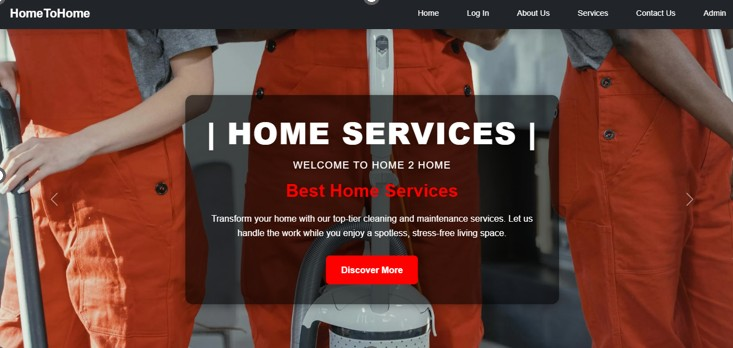

### Login & Registration

- 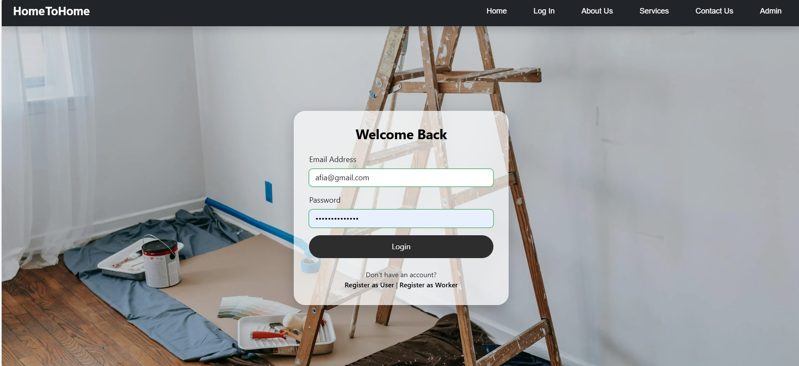
- 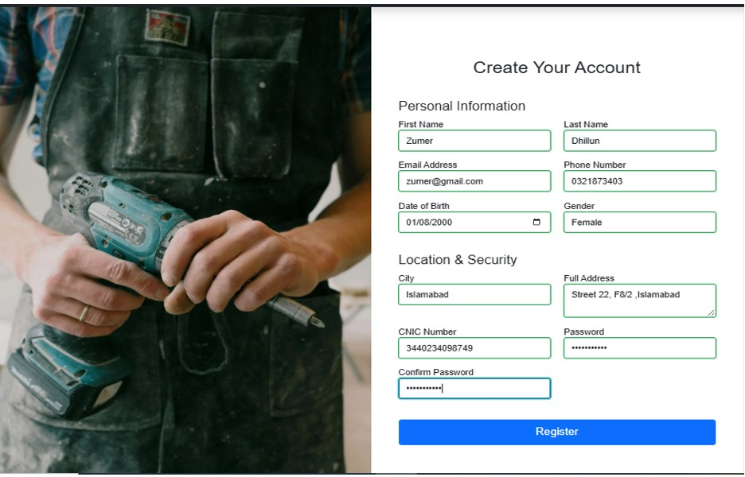
- 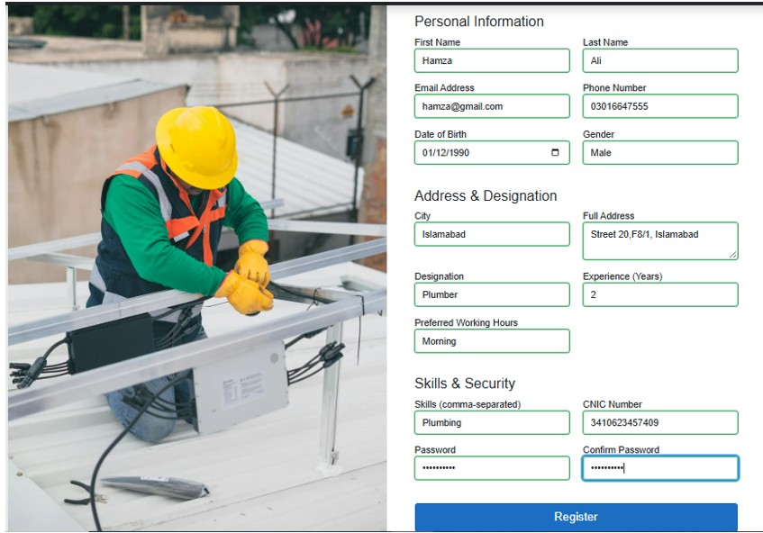

---

###  User Dashboard

- 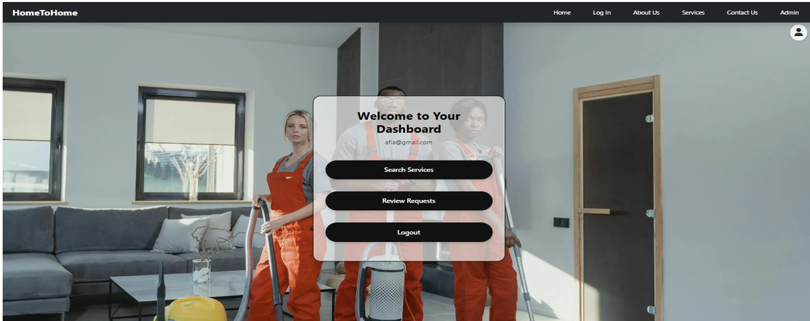
- 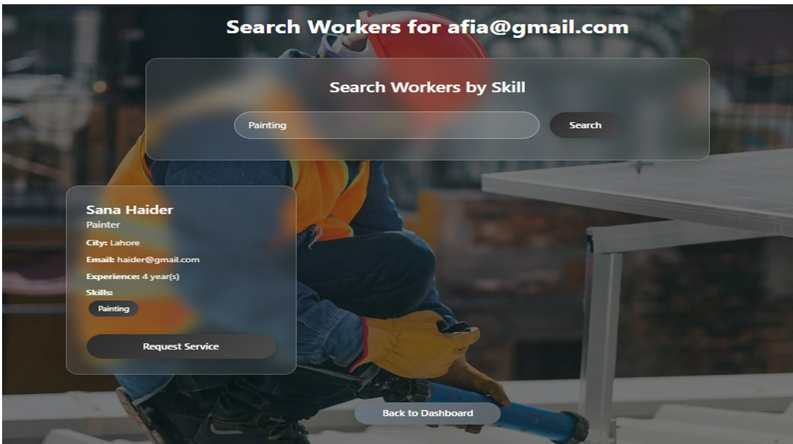
- 
- 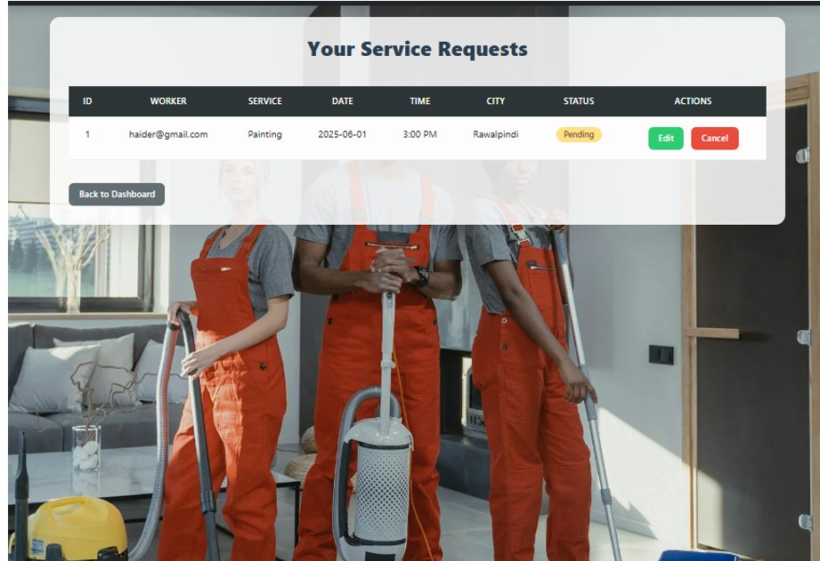
- 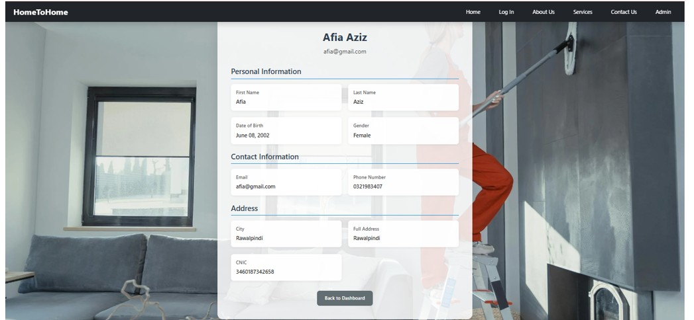

---

### Worker Dashboard

- 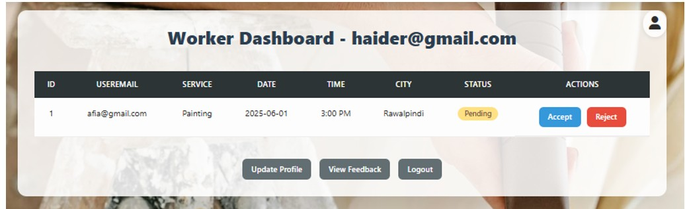
- 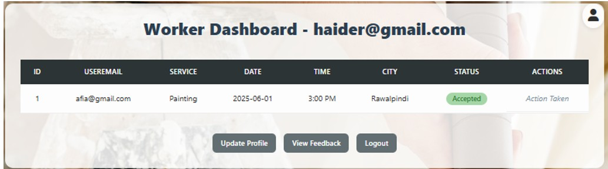

---

### Admin Panel

- 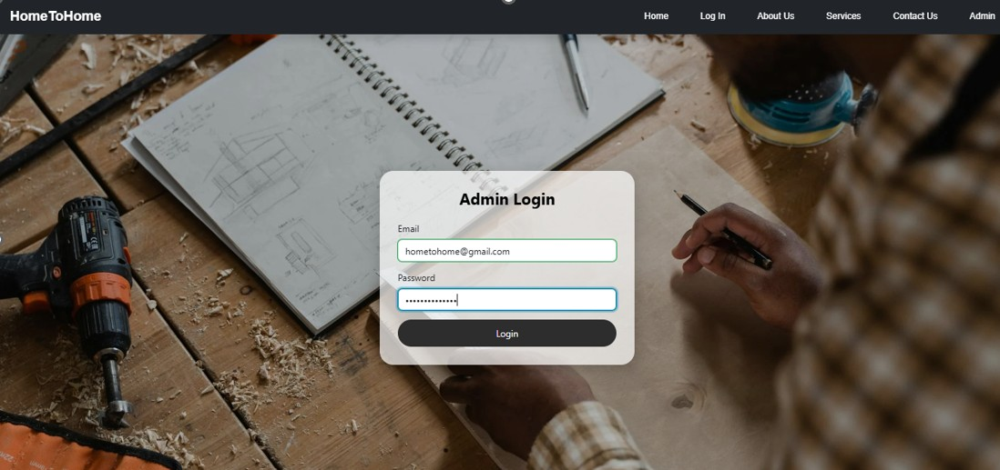
- 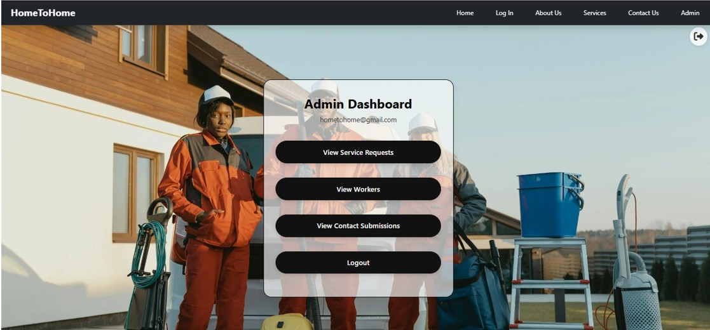
- 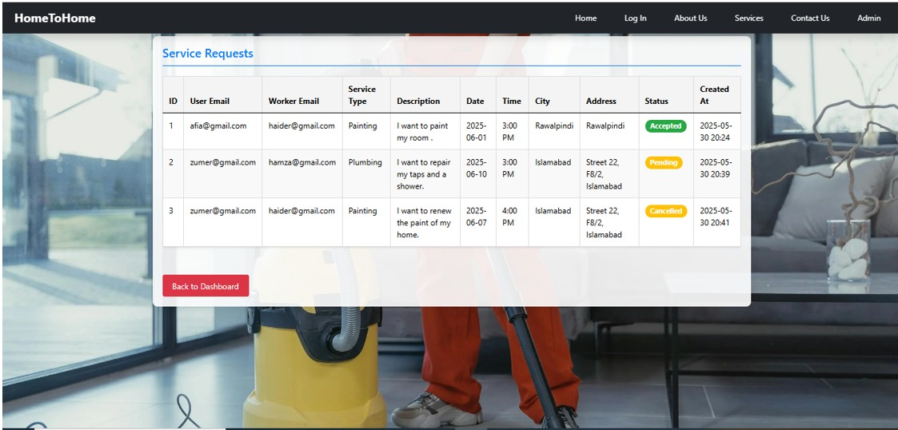
- 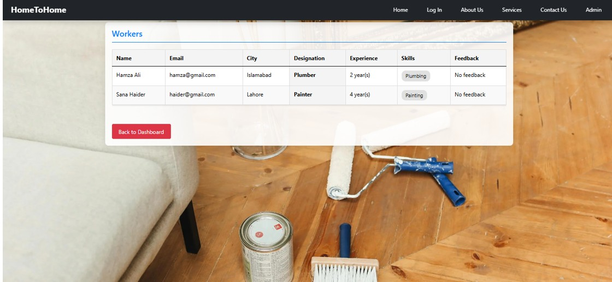
- 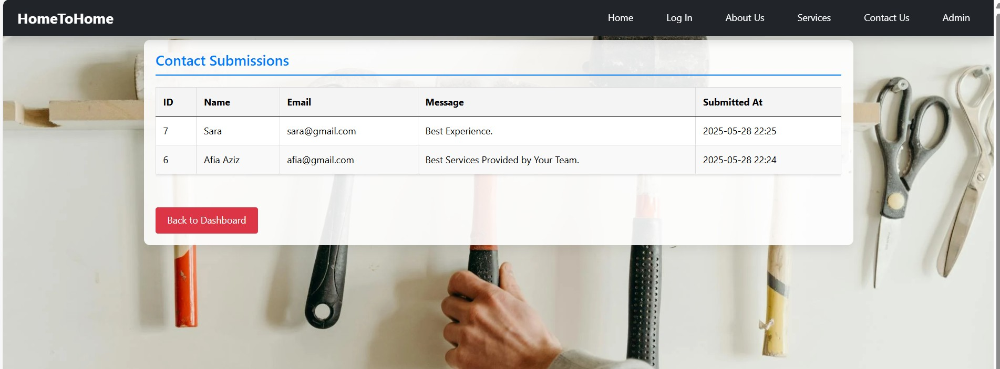

---

