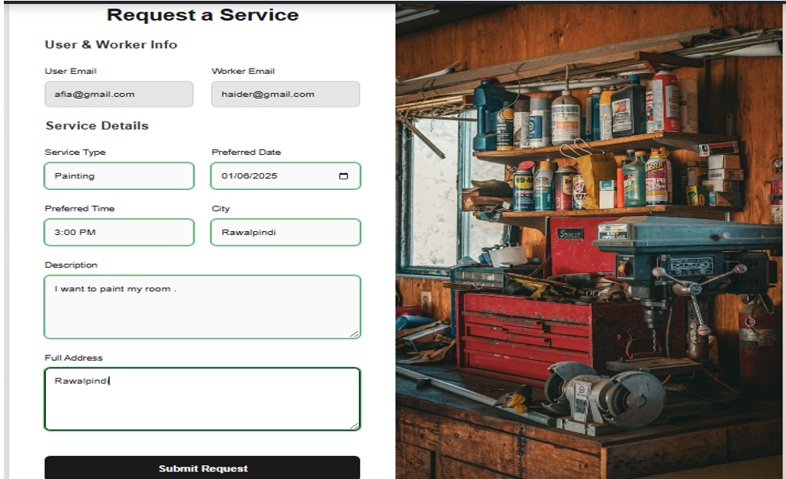

# HomeToHome – A Smart Domestic Service Exchange Platform

HomeToHome is a modern web application built using Blazor Server that acts as a digital bridge between homeowners and trusted domestic service providers. Whether it's plumbing, cleaning, electrical work, or general repairs, HomeToHome simplifies the process of finding reliable help—directly from your browser.

With role-based access, intuitive dashboards, real-time booking flow, and secure login, this platform makes managing home services smarter, faster, and more transparent—for both clients and workers.


---

## Overview

**HomeToHome** is a feature-rich web application developed in **Blazor Server** that bridges the gap between homeowners and skilled domestic service providers such as plumbers, electricians, and cleaners. It eliminates the hassle of finding reliable help by offering real-time booking, profile management, and transparent communication—all in one place.

Whether you're a homeowner looking for help or a skilled worker seeking clients, HomeToHome simplifies service exchange with a clean UI, secure backend, and role-specific workflows.

---

## 🚀 Key Features

| Feature                    | Description                                                                 |
|---------------------------|-----------------------------------------------------------------------------|
| 👥 Role-Based Access       | Users (Homeowners), Workers, and Admins each have unique dashboards         |
| 🔐 Secure Authentication   | Validated login with session management and redirects                       |
| 🔎 Smart Service Search    | Dynamic search and filters based on skills, location, and availability      |
| 📋 Booking Workflow        | Real-time request creation, tracking, and decision-making                    |
| 🧰 Worker Dashboard        | View, accept, or reject incoming service requests                           |
| 📂 User Dashboard          | Track all requests, edit, cancel, or leave feedback                         |
| ⭐ Feedback & Ratings      | Review workers post-service with star ratings and comments                  |
| 📬 Contact Us              | Contact form for queries with admin-side review                             |
| 📍 Google Maps Embed       | Location-based visual reference                                             |
| 📱 Responsive Design       | Mobile, tablet, and desktop support using Bootstrap 5                       |
| 🔧 Admin Panel             | View all users, workers, contact messages, and service requests             |

---

## 👥 Target Users

- 🏠 **Homeowners**: Find and hire reliable service providers.
- 🧑‍🔧 **Domestic Workers**: Showcase skills and receive bookings.
- 🛠️ **Admins**: Oversee operations, user requests, and system messages.

---

## 🧠 Technologies Used

- **Blazor Server (.NET 6)**
- **C# & Razor Components**
- **SQL Server + ADO.NET**
- **Bootstrap 5 + Custom CSS**
- **Google Maps Embed API**
- **Session Storage / Local Storage**
- **Visual Studio 2022**

---

## 📂 Project Structure

- `/Pages` – Razor components (Home, Dashboard, Profile, Booking, Feedback)
- `/Services` – C# classes for DB operations (UserService, WorkerService, etc.)
- `/Models` – User, Worker, Booking, Feedback, ContactUs models
- `/wwwroot` – Static content like CSS, JS, and images
- `appsettings.json` – Database connection string
- `Program.cs` – App startup logic

---

## 🧩 Core Components & Code

| Component               | Purpose                                                 |
|------------------------|---------------------------------------------------------|
| `UserService.cs`       | Handles user registration, login, and sessions          |
| `WorkerService.cs`     | Manages worker data and request handling                |
| `BookingService.cs`    | Booking logic: create, update, cancel, status updates   |
| `ContactService.cs`    | Stores contact form messages in the database            |
| `AdminPanel.razor`     | View all users, messages, and requests                  |
| `WorkerProfileView.razor` | Displays worker cards with "Book Now" button         |

---

## 🖥️ Screenshots

📍 All screenshots should be placed in the `/screenshots` folder.

### 🔐 Login & Registration

- 
- 
- 

---

### 🏠 Home Page & User Dashboard

- 
- 
- 
- 
- 

---

### 👨‍🔧 Worker Dashboard

- 
- 

---

### ⭐ Feedback System

- 
- 

---

### 🛠️ Admin Panel

- 
- 
- 
- 

---

## 🛠️ Setup Instructions

1. **Clone the repo:**
   ```bash
   git clone https://github.com/your-username/HomeToHome.git
   cd HomeToHome
